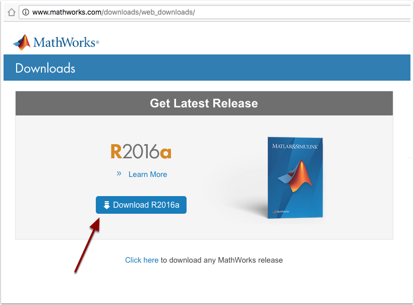
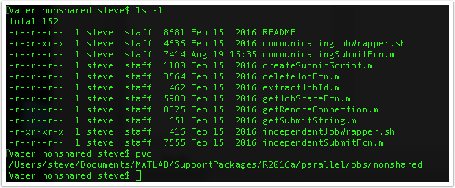

# Matlab Client Cluster Installation

## Introduction

Matlab is software provided by [MathWorks, Inc.](http://mathworks.com). 

If your Organization has purchased licenses for [MATLAB Distributed Computing Server (MDCS)](http://www.mathworks.com/products/distriben/) then you can configure the Matlab application on your local machine to utilize this cluster.  Please [contact your Administrator][HPC Admin] to find out if the software is installed and how many processes you are licensed for. 

## Requirements

  * In order to complete this process ,you'll need to make sure you have access to a Matlab account that has valid licensing for the Matlab client and the parallel computing toolbox. 
  * Make sure you have an account on the HPC Cluster that is configured with Matlab Distributed Compute Server (MDCS) software. You'll want to check with the cluster administrator for configuration details of the MDCS software on the cluster. 
  * (optional) Know how to [ssh into the cluster][ssh] using your account so that you can utilize the queue commands to check on the status of the jobs in conjunction with what Matlab can report about your running jobs on the cluster. 

## Obtain Mathworks account

In order to perform the installation you'll need access to a Mathworks account that has permission to use the Matlab client installer and licensing for this client install as well as a license for the parallel cluster toolbox. This is required in order to use the cluster for Matlab processing. Once you have an account proceed with the rest of the installation. Contact your IT group that manages institutional licensing for help with getting an account with the correct licenses. 

## Installation of Matlab

### Download Matlab Client

Login to the Mathworks site and [download a copy of the latest installer](http://www.mathworks.com/downloads/web_downloads/) (R2016a in this example). 

### Select OS Type 

### Run the installer

}

### Accept License

### Login to Mathworks for license information

### Install Software

### Select license

### Choose Installation location

### Select Products

### Install PBS integration scripts

You can get it from [Mathworks site](http://www.mathworks.com/matlabcentral/fileexchange/52815-parallel-computing-toolbox-integration-for-matlab-distributed-computing-server-with-pbs)

### Find the integration scripts

### Update independentSubmitFcn.m 

### Update communicatingSubmitFcn.m

### Start Matlab and verify parallel toolbox is installed

### Manage Cluster profiles 

### Import Cluster Profile

If your administrator provided a default profile template for your organization you can simply import that profile and skip the following steps to manually create a cluster profile. Continue with the Validate Profile section. 

### Manually create cluster profile

### Edit the new profile

### Update basic configuration

Fill in the following fields: 

  *  Description - This is what you will use to describe this cluster so that you can distinguish it from the list of cluster profiles. 
  *  JobStorageLocation - This is the directory on your local computer where you will store your Matlab jobs. Typically, this is something like /Users/<USERNAME>/Documents/MATLAB (on OSX) but can be any location that you choose. 
  *  NumWorkers - This is the total number of cores that is licensed for Matlab use. You may need to contact the administrator to find out this information. 
  *  ClusterMatlabRoot - This is the directory location of where the Matlab MDCS software is installed on the cluster (/usr/local/Dist/MATLAB/R2016a)
  *  RequiresMathWorksHostedLicensing - use default
  *  LicenseNumber - leave blank

### Update Submit Functions

### Update cluster environment

### Update Files and Folders

### Update Workers

### Update Job and Task Functions

### Validate Profile

Now that you have the profile configured you should run the validation tests to make sure your jobs will successfully run on the compute cluster. 

## Other Resources

  * [Getting Started with Serial and Parallel MATLAB Locally](serial-parallel-matlab-local.pdf)
  * [Getting Started with Serial and Parallel MATLAB Remote](serial-parallel-matlab-remote.pdf)
  * [Parallel Computing Code Examples](https://www.mathworks.com/products/parallel-computing/code-examples.html)
  * [Parallel Computing Toolbox Documentation](http://www.mathworks.com/help/distcomp/index.html)
  * [Parallel and GPU Computing Tutorials](https://www.mathworks.com/videos/series/parallel-and-gpu-computing-tutorials-97719.html)
  * [Parallel Computing Toolbox Video's](https://www.mathworks.com/products/parallel-computing/videos.html)
  * [Parallel Computing Toolbox Webinar's](https://www.mathworks.com/products/parallel-computing/webinars.html)

[ssh]: /usage/ssh.md
[contact]: /contact.md
[HPC Admin]: mailto:ROOT_EMAIL_TO_CHANGE
