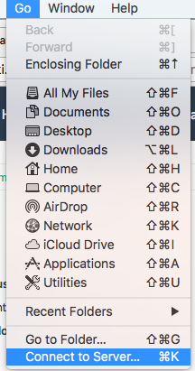
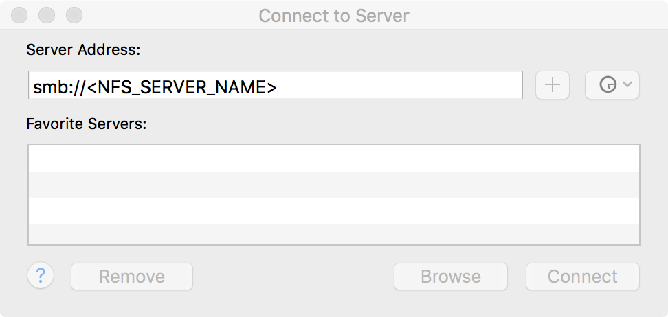
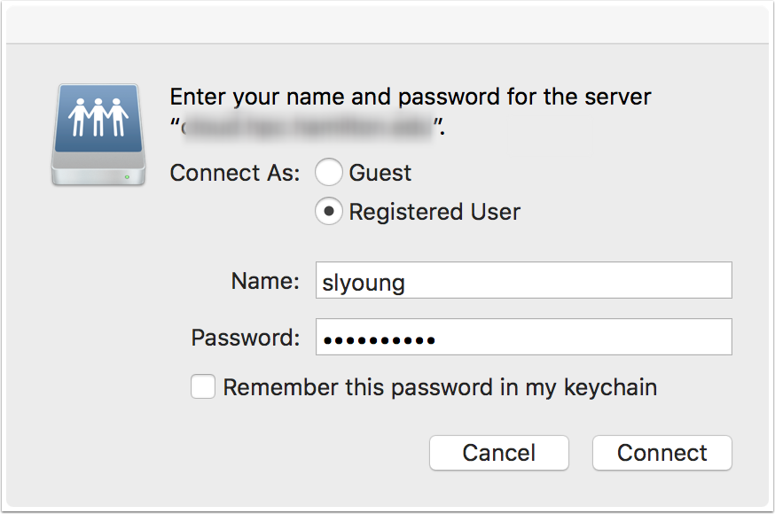
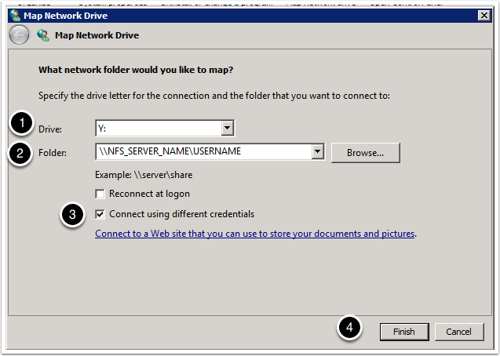
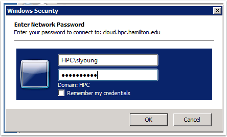

# Graphical File Access (using Samba)

In addition to being able to use the command line to [[:documentation:scp-options|copy Files using scp]], you can also make a connection to the NFS server using Samba to allow the mounting of home directories and research data partitions to your local computer. This makes it appear like a locally connected disk and allows you to work with the files in this space as if it were located on your local computer. To do this we use a software called [Samba](https://www.samba.org/samba/what_is_samba.html) to appear like a Windows server on the network. 

## Instructions for Macintosh

### From the main menu select Go -> Connect to Server

### Enter smb URL to the NFS server (NFS_SERVER_TO_CHANGE) ====

### Enter your login credentials ====

After that you'll mount your home directory and be able to access the files in your home directory through the finder. 

Note: If you have access to other data locations (ie. research data) you'll first be presented with a list of available mount points. The one with your username is your home directory. The other(s) would be the additional data locations. After you select which one to mount it'll show up in the finder as a network drive. 

## Instructions for Windows

### Map a Network Drive

  - Enter the name of the Mapped Drive
  - Enter the name of the network share on the NFS server. It's in the form \\NFS_SERVER_TO_CHANGE\<USER_NAME>
  - Connect using different credentials. You need to select this in order to be sure it uses the HPC servers to authenticate with. (Otherwise it will try to use the credentials of your current Domain.)
  - Select Finish

#### Login to HPC domain account

Be sure to enter the name of the Workgroup (HPC) before your username. (ie. HPC\username )
This will get the system to change the domain to log into. Then enter your password and choose OK. 

Note: Be sure it says "Domain: HPC" below your login credentials. 
