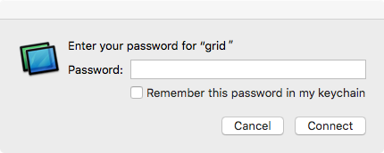
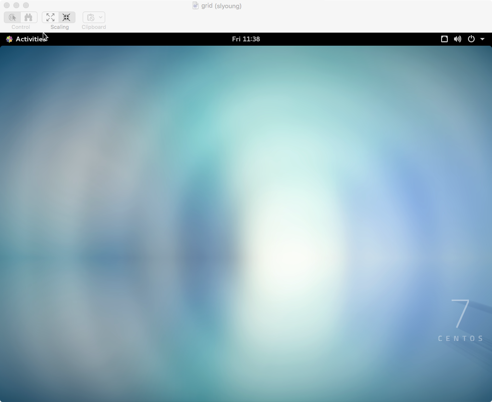

# Setting up VNC for desktop access

## Introduction

According to WikiPedia, ["**Virtual Network Computing (VNC)** is a graphical desktop sharing system that uses the remote frame buffer protocol (RFB) to remotely control another computer."](https://en.wikipedia.org/wiki/Virtual_Network_Computing) 

You can set up a VNC session on the head node of the cluster and connect to it remotely to get a graphical Linux Desktop. 

## Configure the VNC Server

### Start VNC server
 In order to be able to connect to the graphical desktop we need to first start it on the remote computer/head node. When you are logged into the head node type the following command. You should get prompted to create a password to use to allow you to connect to this new graphical session. 

    [slyoung@grid ~]% vncserver

    You will require a password to access your desktops.

    Password:
    Verify:

    New 'grid:1 (slyoung)' desktop is grid:1

    Starting applications specified in /home/slyoung/.vnc/xstartup
    Log file is /home/slyoung/.vnc/grid:1.log

    [slyoung@grid ~]% 

You should also take special notice of the :1 that is assigned above when the session start up. 

This will correlate to the port that you will use to connect to this session. All VNC sessions use ports starting in the 5900 range. So since we're the first vncsession here we have session :1. 

This translates to port 5901 on this host. 

You can now log out of the host and continue setting up VNC on your local computer. 

### Connect with VNC client to VNC Server

#### Mac OS X

 On Mac OS X, it has a built in VNC viewer application. To invoke it from the command line type the following in a Terminal:
 
     $ open vnc://<HEAD_NODE_SERVER_TO_CHANGE:5901
     
You will be prompted for the VNC server password you set when you started the vncserver on HEAD_NODE_SERVER_TO_CHANGE

After entering your password you should get a window of the graphical desktop running on the remote computer. 

 

#### Windows

#### Linux
